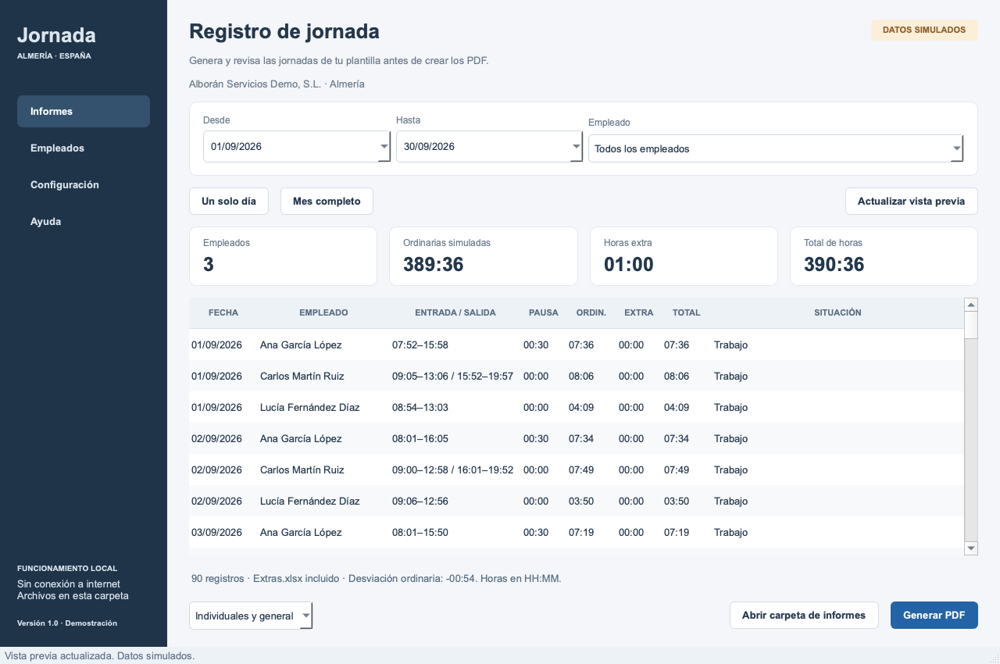

# Jornada Demo

Aplicación de escritorio en español para demostrar el registro horario de empleados
de una empresa en Almería. Lee la configuración desde Excel y genera informes PDF
individuales y un resumen de empresa para un día o un período.

Las marcas son **datos simulados**, identificados como tales en la aplicación y los PDF.



## Descargar y ejecutar en Windows

1. Descarga **JornadaDemo-Windows-x64.zip** desde [Releases](https://github.com/assa99g/jornada-demo/releases).
2. Extrae todo el ZIP en una carpeta con permisos de escritura.
3. Abre **JornadaDemo/Iniciar.cmd**.

El paquete contiene el entorno necesario para Windows 10/11 x64. No requiere instalar
Python ni conectarse a internet. Excel no es necesario para ejecutar la aplicación;
para editar la configuración se necesita un editor de archivos `.xlsx`.

El código, los cálculos, los PDF y el interfaz se han probado en macOS. La ejecución
del paquete en un equipo Windows aún no se ha verificado. Se incluyen
`Diagnostico.cmd` y `Verificar.cmd` para comprobarlo en Windows.

## Configuración

Los archivos están junto a `Iniciar.cmd`. Conserva los encabezados de la fila 5
y escribe los datos a partir de la fila 6. No utilices fórmulas.

| Archivo | Contenido |
| --- | --- |
| Empresa.xlsx | Empresa, dirección, CIF/NIF y parámetros de simulación |
| Empleados.xlsx | Empleados, identificación, puesto, altas, bajas y horario |
| Horarios.xlsx | Turnos, pausas y asignaciones por meses completos |
| Festivos.xlsx | Calendario de Almería y años revisados |
| Incidencias.xlsx | Vacaciones, bajas, ausencias, permisos y jornadas reducidas |
| Extras.xlsx | Intervalos de horas extra; archivo opcional |

La configuración inicial contiene tres empleados ficticios y el calendario de 2026.
Las marcas varían hasta diez minutos y se repiten para el mismo empleado, fecha y
semilla. Los intervalos de horas extra son exactos y no se generan a partir de las
desviaciones ordinarias. Las pausas se descuentan cuando se marcan como no pagadas.

Consulta [la guía completa](JornadaDemo/LEEME.txt) para formatos, turnos nocturnos,
reducciones, límites y reglas de cálculo.

## Informes

Selecciona fechas y empleado, actualiza la vista previa y pulsa **Generar PDF**.
Cada exportación crea una carpeta nueva con los PDF, una copia de la configuración
y los totales en minutos. Los registros individuales se separan por meses.

Los [ejemplos de septiembre de 2026](JornadaDemo/Informes/Ejemplo_septiembre_2026)
incluyen informes de los tres empleados y el resumen general.

## Ejecutar desde el código fuente

Con Python 3.13 y un entorno virtual:

```sh
python -m pip install -r requirements.txt
python JornadaDemo/iniciar.py
```

La carpeta `runtime` y el ZIP de Windows se distribuyen en Releases, no en el historial
de código. Los fuentes y las bibliotecas del paquete están separados.

## Pruebas

```sh
python -m pip install -r requirements-dev.txt
```

macOS / Linux:

```sh
PYTHONPATH=JornadaDemo python -m unittest discover -s tests -v
PYTHONPATH=JornadaDemo QT_QPA_PLATFORM=offscreen python tests/smoke_ui.py
```

Windows PowerShell:

```powershell
$env:PYTHONPATH = "JornadaDemo"
python -m unittest discover -s tests -v
$env:QT_QPA_PLATFORM = "offscreen"
python tests/smoke_ui.py
```

Se han superado 21 pruebas de cálculo, configuración y PDF, además de la comprobación
del interfaz Qt: navegación, selección, exportación y detección de cambios en Excel.

## Fuentes

- [Calendario de Andalucía 2026, BOJA](https://www.juntadeandalucia.es/boja/2025/93/1.html).
- [Fiestas locales de Almería 2026, BOJA](https://www.juntadeandalucia.es/boja/2025/197/28).
- [Modelo de registro de jornada consultado](https://www.wonder.legal/es/creation-modele/hoja-registro-jornada-trabajo).

Los componentes externos y sus licencias se describen en [TERCEROS.txt](JornadaDemo/TERCEROS.txt).
Los documentos originales de requisitos y estado del proyecto se conservan también
en este repositorio.
